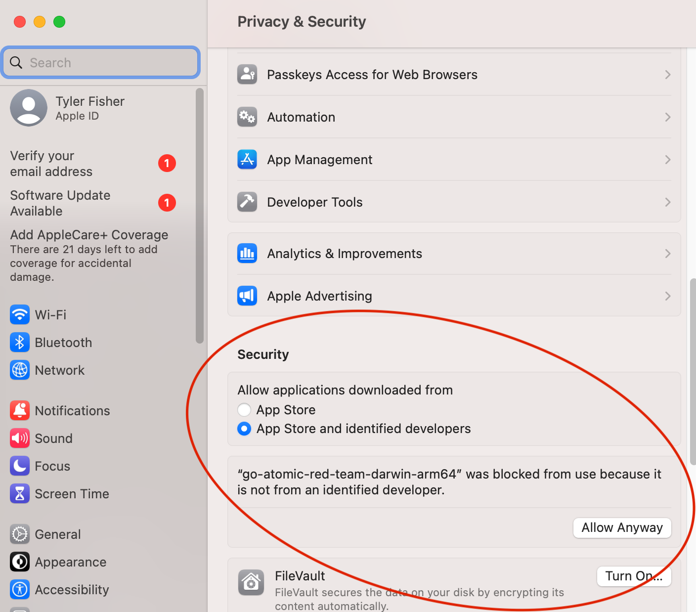

# Darwin troubleshooting guide

On macOS, you will need to explicitly allow the binary to run on your system:

1. Attempt to run the binary - it will be killed by the system.
2. Open the `Privacy & Security` pane in `System Preferences`.
3. Click the `Allow Anyway` button next to the message about the binary being from an unidentified developer.



4. Run the binary again.

```bash
./go-atomic-red-team-darwin-arm64
```

```text
Usage:
  go-atomic [command]

Available Commands:
  help           Help about any command
  task-templates Task templates
  tasks          Tasks

Flags:
  -h, --help             help for go-atomic
  -w, --workdir string   Work directory
```